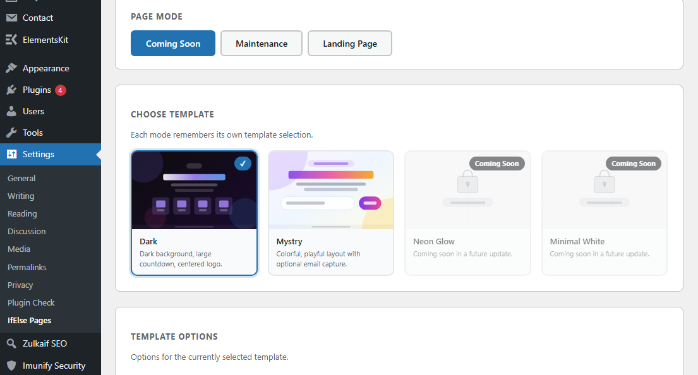

# IfElse Pages – Coming Soon & Maintenance Mode for WordPress

[](https://wordpress.org/)
[](https://www.php.net/)
[](https://www.gnu.org/licenses/gpl-3.0.html)
[](https://wordpress.org/plugins/ifelse-pages-coming-soon-and-maintenance-mode/)

A **lightweight, privacy-friendly WordPress plugin** to display **Coming Soon**, **Maintenance Mode**, or a **Landing Page** while you build or update your website.

Designed to be **simple, fast, and dependency-free**, IfElse Pages lets you control what visitors see while you work behind the scenes.

🔗 **WordPress Plugin Directory**
https://wordpress.org/plugins/ifelse-pages-coming-soon-and-maintenance-mode/

---


# Features

## Page Modes

Choose how visitors see your site while it's under development:

* **Coming Soon** – show a pre-launch page
* **Maintenance Mode** – send a proper `503 Service Unavailable` response
* **Landing Page** – display a custom public landing page

---

## Built-in Templates

Three clean, responsive templates included:

* **Centered Minimal**
* **Split Screen**
* **Dark Mode**

---

## Customization Options

* Upload **site logo**
* Set **background color**
* Upload **background image**
* Optional **countdown timer**
* Custom **title & description**
* **SEO meta title and description**

---

## Role-Based Bypass

Choose which user roles can access the real site while maintenance mode is active.

Examples:

* Administrators
* Editors
* Developers
* Custom roles

Admins bypass the screen automatically by default.

---

## Privacy Friendly

This plugin is designed with privacy in mind.

* ❌ No external API calls
* ❌ No analytics or tracking
* ❌ No advertisements
* ❌ No data collection

---

# Installation

## Install from WordPress

1. Go to **Plugins → Add New**
2. Search for **IfElse Pages**
3. Click **Install Now**
4. Activate the plugin
5. Open **Settings → IfElse Pages**

---

## Manual Installation

1. Download the plugin ZIP
2. Upload to:

```
/wp-content/plugins/ifelse-pages-coming-soon-and-maintenance-mode
```

3. Activate via **WordPress → Plugins**

---

## Install via Composer

If you manage WordPress with Composer:

```
composer require wpackagist-plugin/ifelse-pages-coming-soon-and-maintenance-mode
```

---

# Usage

After activation:

1. Navigate to:

```
Settings → IfElse Pages
```

2. Enable the plugin using the **toggle**
3. Select a **page mode**
4. Choose a **template**
5. Customize content and design
6. Save settings

Visitors will now see the selected screen while allowed roles bypass it.

---

# HTTP Status Behavior

| Mode             | HTTP Status               |
| ---------------- | ------------------------- |
| Coming Soon      | `200 OK`                  |
| Landing Page     | `200 OK`                  |
| Maintenance Mode | `503 Service Unavailable` |

Using a `503` status ensures search engines know the downtime is temporary.

---

# Compatibility

Tested with:

* WordPress **6.2 – 6.9**
* PHP **7.4+**

Works with most themes and page builders because it only intercepts **front-end page requests**.

Does **not affect:**

* `wp-admin`
* REST API
* Logged-in bypass roles

---

# Screenshot



---

# Project Structure

```
ifelse-pages-coming-soon-and-maintenance-mode/
│
├── admin/
├── templates/
├── languages/
├── assets/
├── ifelse-pages-coming-soon-and-maintenance-mode.php
└── readme.txt
```

---

# Changelog

## 1.0.0

Initial public release.

* Coming Soon mode
* Maintenance mode
* Landing page mode
* Template system
* Role bypass
* Countdown timer
* Design customization

---

# Contributing

Contributions are welcome.

You can help by:

* Reporting bugs
* Suggesting features
* Improving translations
* Submitting pull requests

---

# Support

Email: **[mail@zulkaif.com](mailto:mail@zulkaif.com)**
Website: https://zulkaif.com
Plugin Page: https://zulkaif.com/ifelse.html

---

# Authors

**Zulkaif Riaz**
https://zulkaif.com

**Shaham Abbas**
https://shahamabbas.online

---

# License

This project is licensed under **GPL v3**.

https://www.gnu.org/licenses/gpl-3.0.html
